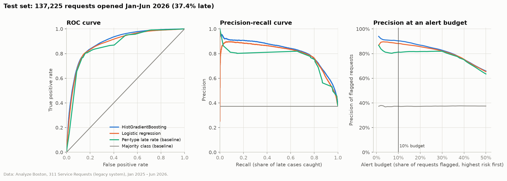

# Boston 311: Will This Request Miss Its Deadline?

Can the City of Boston tell, at the moment a 311 request is submitted, whether it will miss its own service-level (SLA) deadline? I trained on requests from 2025 and tested on January–June 2026.

This follows up on my earlier project, [boston-311-service-analysis](https://github.com/MuradEyvazovv/boston-311-service-analysis), which only charted request volumes and response times.



## Data

- Source: Analyze Boston, [311 Service Requests](https://data.boston.gov/dataset/311-service-requests) (PDDL license). `src/download.py` downloads the 2024–2026 files (about 467 MB) through the portal's CKAN API and records their hashes in `data/raw/manifest.json`.
- The label comes from each case's own SLA deadline (`sla_target_dt`). I recompute it from timestamps instead of using the portal's `on_time` flag, because that flag marks still-open cases whose deadline hasn't passed yet as on time. Open cases already past their deadline count as late; open cases with a future deadline are excluded.
- I kept request types with SLAs of 90 days or less, so only 4 cases in the study window were still unresolved. That leaves 377,168 requests, 36.3% of them late.
- The City's new case system, introduced in late 2025, uses different request types and has too little history, so it isn't modelled.

## Approach

- Time-based split: settings are chosen by training on Jan–Oct 2025 and validating on Nov–Dec 2025, then the models are refit on all of 2025 and tested once on Jan–Jun 2026 (137,225 requests). Training cases whose deadline fell after January 1, 2026 are dropped, because their outcome wasn't known yet on that date.
- Features use only what is known at submission: request type, reason, SLA length, location fields, intake channel, time of day and week, and past-only workload counts (for example, the late rate of the same request type over the previous 30 days).
- Outcome fields (close time, case status, current queue and department) are excluded in code, with an assertion. As a check, adding the case's current open/closed status raises test ROC-AUC from 0.893 to 0.960, the kind of jump that leakage causes.
- Models: a majority-class baseline, a per-type late-rate baseline, logistic regression, and scikit-learn's HistGradientBoosting.

## Results

Test set, January–June 2026:

| Model | ROC-AUC | PR-AUC | Brier | Precision in top 10% |
|---|---:|---:|---:|---:|
| Majority class | 0.500 | 0.374 | 0.234 | 0.373 |
| Per-type late rate | 0.867 | 0.760 | 0.136 | 0.812 |
| Logistic regression | 0.883 | 0.803 | 0.130 | 0.882 |
| HistGradientBoosting | 0.893 | 0.822 | 0.128 | 0.903 |

- Request type explains most of it: a lookup table of per-type late rates already gets 0.867. Gradient boosting adds about 0.03 AUC on top.
- If the City reviewed the 10% of new requests with the highest predicted risk, 90.3% of them would actually be late, compared with 81.2% for the lookup table.
- Parking Enforcement is a quarter of all requests, and most of its cases are never formally closed. Without it, the model still beats the baseline (0.856 vs 0.818 AUC).
- Performance dropped in January and February 2026 (AUC about 0.84) because of a snow backlog the 2025 training year never saw: snow-plowing requests went from 603 in Jan–Feb 2025 to 12,129 in Jan–Feb 2026.

Breakdowns by request type, department, neighborhood and time of day, plus calibration curves and feature importance, are in [docs/DETAILS.md](docs/DETAILS.md).

## Limitations

- "Late" is partly an administrative artifact: 72.9% of late requests were still open at export.
- Only one year of training data. More years (the portal goes back to 2011) would probably help with the winter drift.
- The public export shows each case's final request type, so cases reclassified after intake make the model slightly optimistic.
- Requests with no SLA, or an SLA over 90 days, are out of scope.

## Running it

```bash
python3 -m venv .venv && source .venv/bin/activate
pip install -r requirements.txt
python src/download.py   # about 467 MB into data/raw/
python train.py          # writes results/ and figures/, about 2 minutes
```

The City keeps updating the 2026 files, so a new download will give slightly different numbers. `data/raw/manifest.json` records the file versions I used.

---

Data © City of Boston, published on Analyze Boston under the ODC PDDL. Code released under the MIT License (see `LICENSE`).
