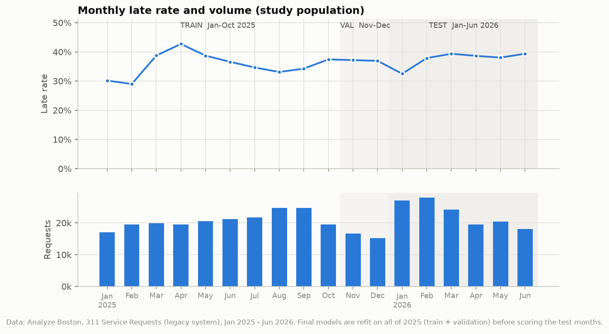
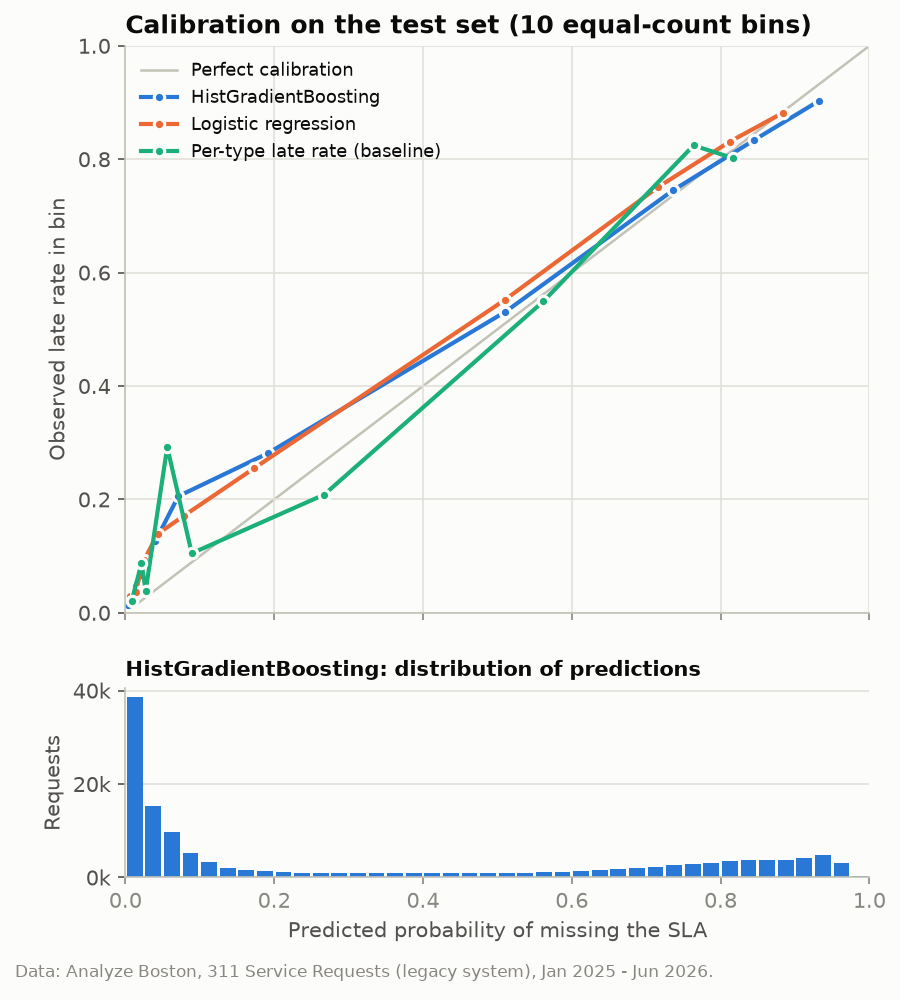
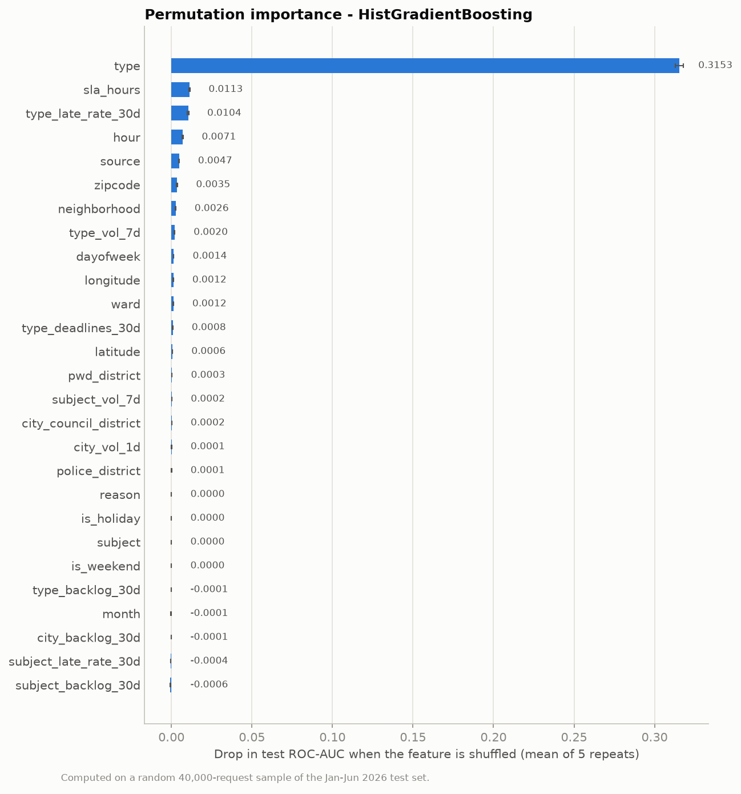
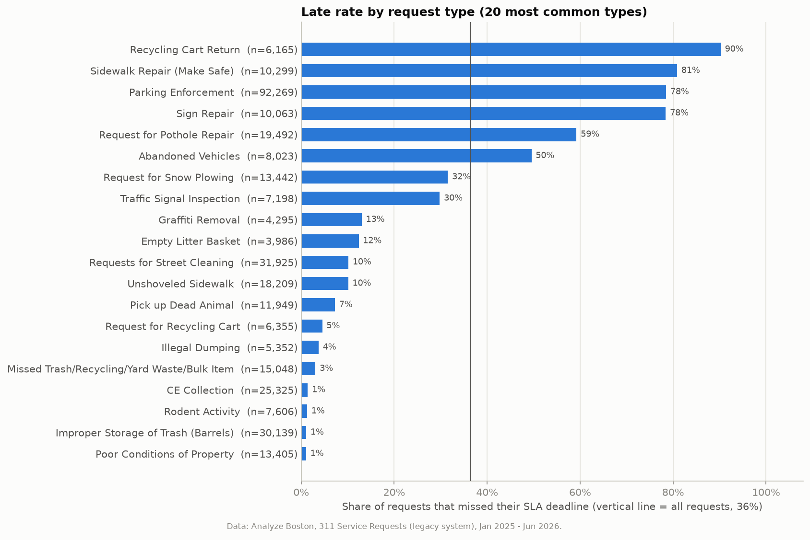
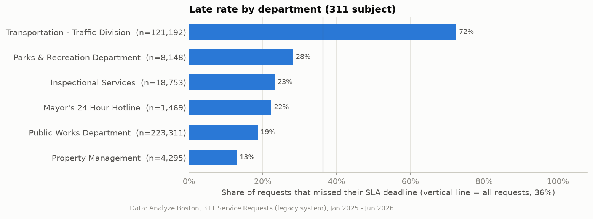
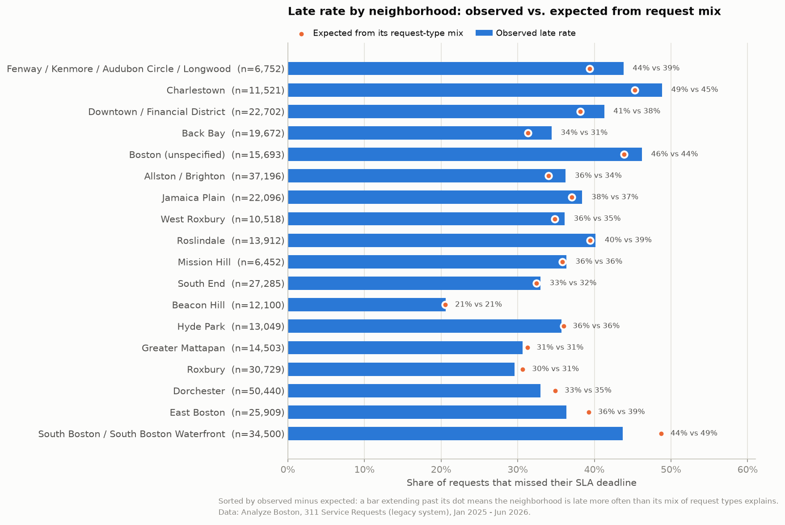
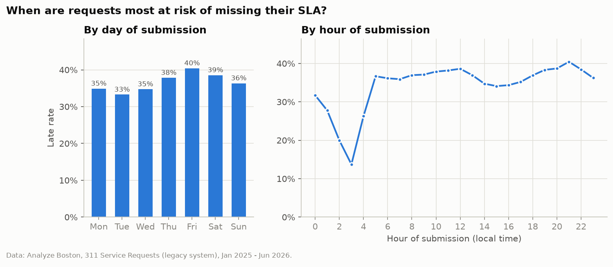

# Boston 311: Will This Request Miss Its Deadline?: full write-up

This is the long version of the [README](../README.md), with every table and figure.

Predicting, at the moment a Boston 311 service request is submitted, whether the City will miss its own service-level (SLA) deadline. The model is trained on 2025 and tested on January–June 2026.

This project builds on my earlier descriptive project, [boston-311-service-analysis](https://github.com/MuradEyvazovv/boston-311-service-analysis). That one charted request volumes and average response times. This one asks a forward-looking question and tests the answer honestly.


## The question

When a resident (or a city worker) files a 311 request, **can we tell right away whether it will be closed late**, using only what is known at submission time? A second question follows: **which request types, departments, neighborhoods and submission times are most at risk?**

A reliable early warning could help a dispatcher decide which new requests need attention before they go overdue.

## Data

**Source:** [Analyze Boston, *311 Service Requests*](https://data.boston.gov/dataset/311-service-requests), published by the City of Boston under the [Open Data Commons Public Domain Dedication and License (PDDL)](http://www.opendefinition.org/licenses/odc-pddl). `src/download.py` finds the files through the official CKAN API (`package_show?id=311-service-requests`) and records their resource ids, sizes and SHA-256 hashes in `data/raw/manifest.json`.

| File (saved under `data/raw/`, gitignored) | Portal resource | Size |
|---|---|---|
| `legacy_2025.csv` | 311 Service Requests - 2025 | 159.5 MB |
| `legacy_2026.csv` | 311 Service Requests - 2026 (to date) | 103.9 MB |
| `legacy_2024.csv` | 311 Service Requests - 2024 (look-back history only, see below) | 182.1 MB |
| `new_system.csv` | 311 Service Requests - NEW SYSTEM | 21.6 MB |
| `data_dictionary_new_system.pdf` | data dictionary (reference) | 0.09 MB |

That is 467.3 MB in total. The export snapshot is the latest timestamp in the files, **2026-09-25 22:34**.

**Two systems.** From late 2025 the City has been moving 311 onto a new case system (`BCS-…` case ids). The new system has a different schema and a different set of request types: 57 service names, versus 115 legacy types in this project's study population. The legacy files hold the long, consistent history, so **the model uses the legacy system only**. The NEW SYSTEM file is downloaded and summarised, but not modelled. It has 61,375 cases, and 84% of them were opened in May 2026 or later, so there is too little history to train on. The portal provides no crosswalk from new-system types to legacy types. The legacy 2024 file is used **only** to compute the 30-day look-back features for early-January 2025 cases. No 2024 case is trained or evaluated on.

### Target: the City's own SLA, recomputed to handle censoring

Every legacy case has an `sla_target_dt`, which is the deadline the CRM sets from the request type's SLA when the case is opened. It follows a business-day calendar: a 1-business-day SLA opened on a Friday gets about 72 hours. The portal also publishes an `on_time` flag (ONTIME/OVERDUE), so **no arbitrary "N days" threshold is needed.**

I recompute the label from timestamps rather than trusting `on_time`. The portal evaluates `on_time` as of the export, so it shows a still-open case whose deadline hasn't arrived as ONTIME, even though nobody knows yet how that case will end. That is right-censoring, and it would bias recent months toward "on time" (1,997 such cases carry this flag).

| Situation at export | Label |
|---|---|
| closed after the deadline | **late** |
| still open and the deadline has passed | **late** (it has already missed the SLA, whenever it ends) |
| closed on or before the deadline | **on time** |
| still open and the deadline is in the future | **censored** (outcome unknown), excluded |

On all 505,588 legacy cases where both labels exist, the recomputed label agrees with the portal's flag **99.98%** of the time.

To keep censoring from biasing the test months, I limited the question to SLAs of **at most 90 days** and ended the test window on 2026-06-30. Long-SLA types include Tree Maintenance and New Tree Requests (365-day SLA), residential pest and living-conditions complaints (120 days), and contractor complaints (720 days). For their 2026 cases, only the ones that were closed quickly are resolved yet, so keeping just those would make those types look artificially on-time. With these limits, only **4** cases in the whole study window were still censored, and they were dropped.

| Filter | Cases left |
|---|---|
| legacy cases opened 2025-01-01 to 2026-06-30 | 426,881 |
| has an SLA deadline (drops types with no SLA, e.g. Needle Pickup) | 394,439 |
| SLA ≤ 90 days | 377,172 |
| outcome known at export (4 censored open cases dropped) | **377,168** |

Of the requests in the study population, 36.3% missed their SLA.

Two caveats matter for every number below:

- **Most "late" requests were never closed.** 72.9% of the late requests were *still open* at export: they missed their deadline and still have no close date. By the City's definition they are overdue, and the portal flags them OVERDUE too. But part of this may be record-keeping (cases never formally closed) rather than work that never happened.
- **Parking Enforcement dominates.** It is 24.5% of all requests and 52.8% of all late ones. It is late 78.5% of the time, and 76.8% of its cases are still open. So for this type, "late" largely means "never closed in the CRM", not necessarily "the officer never came". I report results with and without it.

## Approach

**Time-based split, with no peeking at outcomes that weren't known yet**

| Set | Requests opened | Used for | Rows |
|---|---|---|---|
| selection-train | Jan–Oct 2025 (deadline before 2025-11-01) | fitting candidates | 204,658 |
| validation | Nov–Dec 2025 | choosing hyperparameters | 31,756 |
| final train | Jan–Dec 2025 (deadline before 2026-01-01) | refit of the chosen models | 237,274 |
| **test** | **Jan–Jun 2026** | **reported once** | **137,225** |

A model deployed on 1 Jan 2026 could only learn from cases whose outcome was already known that day. So training rows whose deadline fell after the cutoff are left out: 2,669 late-December 2025 cases.



**Features (only what is known at submission)**

| Group | Features |
|---|---|
| What | `type`, `reason`, `subject` (the responsible department; 100% determined by `type`, so fixed at intake), `sla_hours` (the SLA length the CRM attaches) |
| Where | neighborhood, ZIP, public-works / city-council / police district, ward, latitude, longitude |
| How | intake channel (`source`: app, phone call, employee-generated, …) |
| When | hour, day of week, month, weekend, US federal holiday |
| Workload (past only) | computed **as of midnight before submission**: requests of the same type / department opened in the last 7 days, requests opened in the last 30 days that were still unresolved, and the late rate among same-type requests whose deadline passed in the last 30 days (their outcome is fully known by then) |

**Leakage checks**

- Explicitly **excluded** (`src/features.py::FORBIDDEN`, with an assertion in the pipeline):
  - `closed_dt`, `case_status`, `closure_reason`, `on_time` and `closed_photo`, because they describe the outcome.
  - `queue` and `department`, because they show the *current* work queue. Cases can be re-routed after intake: within a request type, the most common department code covers only 94.3% of cases, and the most common queue only 69.55%. By contrast, `subject` and `reason` are 100% fixed by the type, so they are set at intake and kept as features.
  - `case_title`, because it is editable free text (and 93.6% identical to `type` anyway).
  - `submitted_photo` would be legitimate, but it is empty in the legacy export.
- **Univariate scan:** each feature on its own was scored on the validation months. The strongest was the recent same-type late rate (AUC 0.914), followed by `type` (0.913). No feature came close to separating the classes perfectly.
- **Leakage demo:** refitting the same model with `case_status` (Open/Closed at export) leaked in raises test ROC-AUC from 0.8934 to **0.9595**. That is exactly the kind of too-good-to-be-true jump this setup is meant to prevent. The leaky model is not used anywhere else.

**Models.** There are two baselines: the majority class, and the per-type historical late rate from 2025 (smoothed for rare types). The two models are logistic regression (one-hot categoricals plus log-scaled counts; C chosen from {0.03, 0.3, 3}) and scikit-learn's `HistGradientBoostingClassifier` with native categorical support. For HGB, 3 configurations were tried, each checked every 25 boosting rounds (up to 500) on the validation months. Selection used **validation log loss**, not the test set. Chosen: C = 0.03; HGB with learning rate 0.05, 63 leaves, min 100 samples per leaf and 350 rounds.

**Metrics.** ROC-AUC and PR-AUC (ranking); Brier score and 10-bin calibration error (probability quality); and **precision at a fixed alert budget**. That last one answers: if the city can only review the 10% of new requests with the highest predicted risk, how many of those turn out to be late?

## Results

**Test set: 137,225 requests opened January–June 2026, 37.4% late**

| Model | ROC-AUC | PR-AUC | Brier ↓ | Calib. error ↓ | Precision @ 10% budget | Recall @ 10% budget |
|---|---|---|---|---|---|---|
| Majority class (baseline) | 0.5000 | 0.3741 | 0.2344 | 0.0166 | 0.3732 | 0.0998 |
| Per-type late rate (baseline) | 0.8667 | 0.7599 | 0.1364 | 0.0610 | 0.8123 | 0.2172 |
| Logistic regression | 0.8833 | 0.8027 | 0.1305 | 0.0491 | 0.8817 | 0.2357 |
| **HistGradientBoosting** | **0.8934** | **0.8216** | **0.1277** | **0.0464** | **0.9030** | **0.2414** |

**Same models, test set without Parking Enforcement (105,580 requests, 23.9% late)**

| Model | ROC-AUC | PR-AUC | Brier ↓ | Precision @ 10% budget |
|---|---|---|---|---|
| Majority class (baseline) | 0.5000 | 0.2391 | 0.1959 | 0.2332 |
| Per-type late rate (baseline) | 0.8184 | 0.6143 | 0.1328 | 0.7798 |
| Logistic regression | 0.8378 | 0.6416 | 0.1282 | 0.7778 |
| **HistGradientBoosting** | **0.8558** | **0.6780** | **0.1246** | **0.8004** |

What the numbers say:

- **Request type is most of the story.** The type's historical late rate alone reaches ROC-AUC 0.8667. The gradient-boosted model adds +0.027 AUC overall, and +0.037 without Parking Enforcement. That is real, but modest.
- **At a 10% alert budget**, 90.3% of HistGradientBoosting's flagged requests were actually late, versus 81.2% for the type baseline and 37.3% for random picks. Those flags still catch only 24.1% of all late requests, because there are far more late requests than alerts.
- **Workload features help a little.** Refitting HGB without them lowers test ROC-AUC from 0.8934 to 0.8868 and worsens the Brier score from 0.1277 to 0.1352. Most of the gain is in *calibration*: they let the model track the rising 2026 late rate. Precision at 10% was actually slightly higher without them (0.9081 vs 0.9030).
- **Validation looked better than test** (HGB validation AUC 0.9393 vs test 0.8934). Performance dipped in the winter months: test ROC-AUC was 0.8462 in January and 0.8364 in February, against 0.9019–0.9429 in March–June. See *limitations* for why.



Both models are reasonably calibrated. They slightly **under-predict** in the middle range because the test months ran later (37.4% late) than the final training data (35.7%).



Permutation importance (drop in test ROC-AUC when a feature is shuffled) is dominated by `type` (0.3153). Next come `sla_hours` (0.0113), the recent same-type late rate (0.0104), hour of submission (0.0071) and intake channel (0.0047). Correlated features share credit, so `reason`/`subject` score about 0 because `type` already carries their information. The ablation above measures the workload features better than permutation does.

### Who is most at risk?



- **Request types** (at least 1,000 requests, Jan 2025–Jun 2026):
  - Most often late: Recycling Cart Return (90.2%), Sidewalk Repair (Make Safe) (80.9%), Parking Enforcement (78.5%), Sign Repair (78.4%), Work w/out Permit (68.0%), Street Light Outages (66.2%) and Pothole Repair (59.2%).
  - Almost never late: many sanitation requests, such as Improper Storage of Trash (1.1%) and CE Collection (1.4%).



- **Departments:** Transportation – Traffic Division misses 72.5% of its SLAs, which is mostly Parking Enforcement and sign/signal work. Public Works handles the most requests (223,311) and misses 18.7%.



- **Neighborhoods:** raw late rates run from 20.6% (Beacon Hill) to 48.8% (Charlestown), but most of that gap comes from *which kinds of requests* each neighborhood files. After comparing each neighborhood with the rate its request-type mix predicts:
  - Fenway/Kenmore (+4.4 points), Charlestown (+3.5) and Downtown (+3.1) are somewhat worse than expected.
  - South Boston (−5.0), East Boston (−2.9) and Dorchester (−2.0) are better than expected.



- **Timing:** requests filed on Friday (40.4%) or Saturday are late more often than those filed early in the week (Tuesday 33.3%), which is consistent with deadlines landing over the weekend. By hour, evening submissions peak around 9 pm (40.4%). The 3 am low (13.7%) most likely reflects a different mix of request types overnight, not faster service.

## What didn't work / limitations

- **Modest lift over a simple rule.** A lookup table of per-type late rates gets most of the way. I would present the ML model as a refinement of that rule, not a replacement.
- **Winter drift.** The 2025 training year had few snow-related requests; early 2026 had many more. Snow-plowing requests jumped from 603 (Jan–Feb 2025, 4.6% late) to 12,129 (Jan–Feb 2026, 33.0% late). Unshoveled-sidewalk requests went from 5,927 at 2.6% late to 11,162 at 14.8% late. A model trained on one year had never seen a snow backlog like that. More years of training data (the portal has them back to 2011) would be the first fix.
- **"Late" is partly an administrative artifact.** 72.9% of all late requests in the study population were still open at export. For some types, notably Parking Enforcement, cases are rarely formally closed. That is why I also report results without it. A cleaner target, such as "was the work actually done on time?", isn't available in the public data.
- **Population restrictions.** Requests with no SLA (e.g. Needle Pickup, Encampments) and requests with SLAs longer than 90 days are outside the question, so the model says nothing about them.
- **Final values, not intake values.** The public export shows each case's *final* `type`. If staff reclassify a case after intake, this model sees the corrected type, which is slightly optimistic. The SLA deadline appears to be set at intake (it follows business-day rules from the open time), but the data doesn't prove it is never edited.
- **Workload features are approximations.** They count only legacy-system requests, and in 2026 part of the work moved to the new system.
- **New system not modelled** (see *Data*). Its types have no official mapping to legacy types.
- **The descriptive "who is at risk" results are correlations**, not causes. For example, time-of-day effects are confounded with the kinds of requests filed at each hour.

## How to reproduce

```bash
git clone https://github.com/MuradEyvazovv/boston-311-on-time-prediction.git
cd boston-311-on-time-prediction
python3 -m venv .venv && source .venv/bin/activate
pip install -r requirements.txt

python src/download.py   # ~467 MB from data.boston.gov into data/raw/ (+ manifest.json)
python train.py          # writes results/results.json, results/*.csv, figures/*.png
```

The final full run of `train.py` took about 2 minutes (118 s wall-clock) on an Apple M3 Max. Earlier runs took 10–12 minutes while other heavy jobs were competing for the CPU. The HistGradientBoosting grid and permutation importance are the slow parts. `train.py` caps OpenMP at 6 threads, because using every core made gradient-boosting fits several times slower on this machine. Seeds are fixed, and repeated runs gave identical metrics. Note that the City keeps updating the 2026 files (they were last modified on the day of download), so a later download will contain more (and more resolved) cases and slightly different numbers. `data/raw/manifest.json` records exactly which file versions were used.

```
src/download.py   CKAN discovery + download + manifest
src/data.py       loading, cleaning, SLA label + censoring, population filters
src/features.py   submission-time features, past-only workload features, leakage guard
src/models.py     baselines, logistic regression, HistGradientBoosting
src/evaluate.py   ROC-AUC, PR-AUC, Brier, calibration error, precision at alert budget
src/plots.py      figures
train.py          end-to-end pipeline
```
